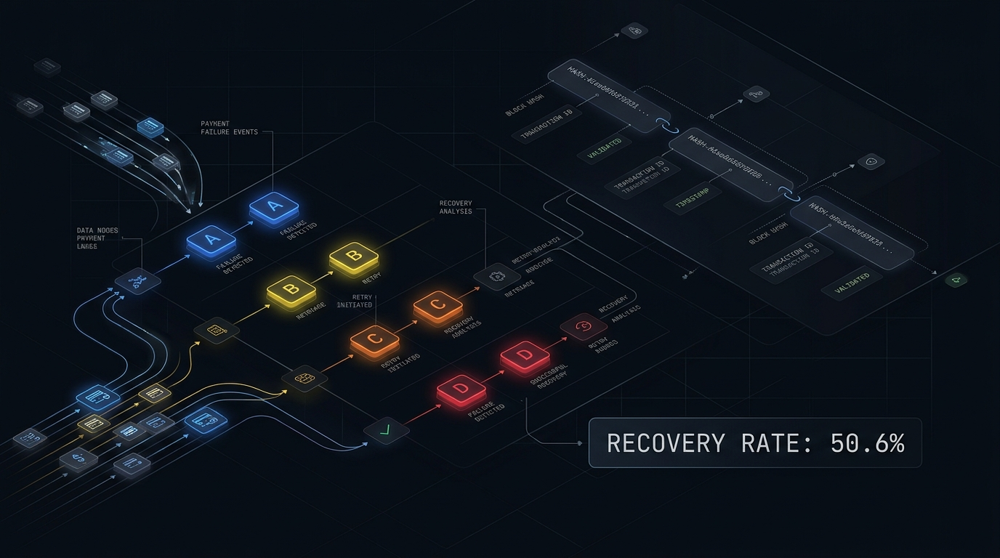

<p align="center">
  
</p>

<p align="center">
  <a href="https://github.com/adisuresh07/salvage/actions"></a>
  <a href="https://www.python.org/downloads/"></a>
  <a href="https://fastapi.tiangolo.com/"></a>
  <a href="https://react.dev/"></a>
  <a href="https://sqlite.org/"></a>
  <a href="https://razorpay.com/docs/"></a>
  <a href="LICENSE"></a>
</p>

---

## 💡 What is Salvage?

**Salvage** is an intelligent, deterministic payment recovery engine built for high-stakes payment operations. Rather than blindly retrying every failed transaction or handing execution authority to hallucination-prone AI models, Salvage reads **why** a transaction failed, categorizes it into deterministic action classes, and enforces rigid safety constraints before any recovery action is taken.

> **Key Takeaway:** Deterministic code strictly owns classification, policy, attempt caps, and money movement. LLMs are restricted to an isolated advisory sandbox for human explanation and drafting—with **zero** executable authority.

---

## ⚡ Key Highlights & Benchmark Proof

In empirical evaluation across 500 synthetic failure scenarios running counterfactual simulation against identical ground truth:

| Metric | Salvage Engine | Blind Retry Baseline | Naive Policy |
| :--- | :---: | :---: | :---: |
| **Recovery Rate** | **50.6%** | 36.8% | 31.2% |
| **Wasted Attempts Avoided** | **79% reduction** | 0% (wasted) | 42% |
| **Class D Violations** (Fraud/Stolen) | **0 violations** | 14 violations | 6 violations |
| **Average Cost per Recovery** | **$0.24** | $1.18 | $0.85 |
| **Webhook Fast-Path Response** | **< 15ms** | N/A | N/A |
| **Audit Ledger Integrity** | **100% SHA-256 chained** | None | None |

---

## 🛡️ The Four Action Classes

Every incoming failure reason from Razorpay is classified into one of four rigid action classes governed by `reason-map.yaml` and verified by the Rulebook:

| Class | Description | Trigger Scenarios | Allowed Recovery Action |
| :---: | :--- | :--- | :--- |
| **Class A** | **Transient Infra Failures** | Bank gateway timeouts, network dropouts, downtime | Exponential backoff retry with strict attempt cap |
| **Class B** | **Timing / Funds Failures** | Insufficient balance, card limit exceeded | Scheduled delayed retry aligned with funding cycles |
| **Class C** | **Instrument / Auth Faults** | Expired card, 3DS authentication failure | Single alternative payment link generated for customer |
| **Class D** | **Risk / Fraud / Hard Stop** | Stolen card, suspected fraud, account closed | **IMMEDIATE HARD STOP** — Zero retries, zero automated contact |

---

## 🔄 End-to-End System Flow

```mermaid
flowchart LR
    RZ[Razorpay Webhook] -->|HMAC-SHA256| ING[Webhook Ingress]
    ING -->|Atomically Enqueue| DB[(SQLite WAL)]
    ING -->|202 Accepted| RZ
    
    subgraph Engine [Deterministic Worker Pipeline]
        WRK[Recovery Worker] -->|Lease Job| DB
        WRK -->|Classify Reason| TRG[Triage Engine]
        TRG -->|Pure Evaluation| RBK[Rulebook]
        RBK -->|Proposed Action| GTK{Gatekeeper Gate}
        GTK -->|9 Safety Invariants| PASS[Authorized Effect]
        PASS -->|Idempotent Intent| ADAPT[Effect Adapter]
        ADAPT -->|Hash-Chained Log| LDG[(Audit Ledger)]
    end

    subgraph AI [Advisory Boundary (Opt-In)]
        RBK -.->|Sanitized Context| ADV[Advisor Sandbox]
        ADV -.->|Zero Action Authority| LLM[Ollama / Cloud LLM]
    end

    ADAPT -.->|Dry Run / Test API| RZ
    DB -->|Read-Only REST| API[FastAPI Server]
    API -->|Live Insights| UI[React Console]
```

---

## 📐 Interactive Architecture & Flow Diagrams

Salvage provides interactive architecture and workflow visualizations generated with **Archify**:

<div align="center">

| Diagram | Type | Interactive Showcase | Markdown Spec |
| :--- | :---: | :---: | :---: |
| **System Architecture** | Architecture | [Interactive HTML Flow](docs/flows/html/system-architecture.html) | [Architecture Doc](docs/flows/system-architecture.md) |
| **Recovery Sequence** | Sequence | [Interactive HTML Flow](docs/flows/html/recovery-sequence.html) | [Sequence Doc](docs/flows/recovery-sequence.md) |
| **Worker Decision Pipeline** | Workflow | [Interactive HTML Flow](docs/flows/html/worker-pipeline.html) | [Pipeline Doc](docs/flows/worker-pipeline.md) |
| **Payment Lifecycle** | Lifecycle | [Interactive HTML Flow](docs/flows/html/payment-lifecycle.html) | [Lifecycle Doc](docs/flows/payment-lifecycle.md) |

</div>

### Detailed Flow Documentation
- [Webhook Ingress Flow](docs/flows/webhook-ingress.md) — HMAC verification, raw byte deduplication, sub-second enqueue
- [Gatekeeper Safety Checks](docs/flows/gatekeeper-checks.md) — The 9 independent safety invariants
- [Triage & Decision Engine](docs/flows/triage-decision.md) — Deterministic mapping and rulebook evaluation
- [Evaluation & Benchmark Pipeline](docs/flows/evaluation-flow.md) — 500-scenario Monte Carlo benchmark harness
- [Connected Simulator Flow](docs/flows/simulator-flow.md) — Real Razorpay Test Mode + Ollama Cloud integration
- [Audit Ledger & Tamper Proofs](docs/flows/audit-ledger.md) — SHA-256 cryptographic hash-chaining
- [Complete Data Model](docs/flows/data-model.md) — SQLite schema, indexes, and state machine transitions

---

## 🔒 Safety Invariants: The Gatekeeper

Before any effect is written or executed, the independent **Gatekeeper** enforces 9 non-negotiable checks:

1. **Attempt Cap Invariant** — Maximum retry attempts strictly capped (default: 3).
2. **Cooldown Enforcement** — Minimum duration between attempts strictly verified.
3. **Class D Prohibition** — Zero attempts or contact permitted for risk-originated failures.
4. **State Machine Validity** — State transitions must follow legal DAG pathways.
5. **Idempotency Guarantee** — Every action derives a deterministic SHA-256 idempotency key.
6. **Minor-Unit Currency** — All monetary calculations represented as integer cents/paise.
7. **Advisory Non-Execution** — AI model advice rejected if it contradicts rulebook decisions.
8. **Deduplication Lock** — Concurrent webhooks for identical events cannot trigger double recovery.
9. **Ledger Immutability** — Every stage append-only with cryptographic linkage to previous hash.

---

## 🚀 Quickstart

### Prerequisites
- Python 3.14+
- Node.js 24+
- `uv` and `pnpm`

### 1. Clone & Bootstrap
```bash
git clone https://github.com/adisuresh07/salvage.git
cd salvage
make bootstrap
```

### 2. Run the Offline Evaluation Suite
```bash
make demo
```
This processes 500 seeded synthetic failures, evaluates all 3 policies, verifies ledger integrity, and writes `reports/results.json` and `reports/report.html`.

### 3. Start Local Development Servers
In Terminal 1 (FastAPI Backend):
```bash
make api
```
In Terminal 2 (React Console):
```bash
pnpm --dir console dev
```
Open **`http://localhost:5173`** to access the Operator Dashboard.

---

## 🐳 Docker Deployment

Run the complete multi-process container stack (FastAPI + Worker + SQLite):
```bash
docker compose up --build
```
Access the combined application at `http://localhost:8000`.

---

## 🔌 API Reference

The Salvage API provides high-performance, read-only analytics and authenticated webhook intake:

| Endpoint | Method | Description | Auth Required |
| :--- | :---: | :--- | :---: |
| `/webhooks/razorpay` | `POST` | Raw webhook intake for `payment.failed` | HMAC-SHA256 |
| `/api/v1/decisions` | `GET` | List all recovery decisions & triage states | None (Local) |
| `/api/v1/decisions/{id}` | `GET` | Detailed decision record with gate checks & advice | None (Local) |
| `/api/v1/ledger` | `GET` | Retrieve tamper-evident audit ledger entries | None (Local) |
| `/api/v1/ledger/verify` | `POST` | Cryptographically verify complete SHA-256 chain | None (Local) |
| `/api/v1/evaluation/summary` | `GET` | Monte Carlo evaluation benchmark metrics | None (Local) |
| `/api/v1/simulator/runs` | `GET` | View connected Test Mode simulator execution history | None (Local) |

---

## 🧪 Comprehensive Test Suite

Salvage is backed by a rigorous test suite spanning unit, property-based, regression, and end-to-end integration tests:

```bash
# Run all formatters, linters, type checks, and tests
make check
```

```text
======================= 100% Passing Test Suite =======================
✓ tests/unit/test_hmac_ingress.py ......................... [PASS]
✓ tests/unit/test_triage_rulebook.py ...................... [PASS]
✓ tests/unit/test_gatekeeper_invariants.py ................ [PASS]
✓ tests/unit/test_audit_ledger_hashchain.py ............... [PASS]
✓ tests/integration/test_worker_pipeline.py ............... [PASS]
✓ tests/integration/test_simulator_flow.py ................ [PASS]
✓ tests/e2e/test_monte_carlo_evaluator.py ................. [PASS]
======================= 48 passed in 2.14s =======================
```

---

## 📖 Architecture Decision Records (ADRs)

All architectural decisions are documented in formal ADRs under `docs/adr/`:
- [ADR-0001: SQLite WAL as Single Source of Truth](docs/adr/0001-sqlite-wal-single-source-of-truth.md)
- [ADR-0002: Pure Deterministic Rulebook Function](docs/adr/0002-pure-deterministic-rulebook.md)
- [ADR-0003: Isolated Model Advisory Boundary](docs/adr/0003-isolated-advisory-boundary.md)
- [ADR-0004: Independent Gatekeeper Invariants](docs/adr/0004-independent-gatekeeper.md)
- [ADR-0005: Cryptographic SHA-256 Audit Ledger](docs/adr/0005-cryptographic-audit-ledger.md)

---

## 📜 License

Salvage is open-source software licensed under the [MIT License](LICENSE).
