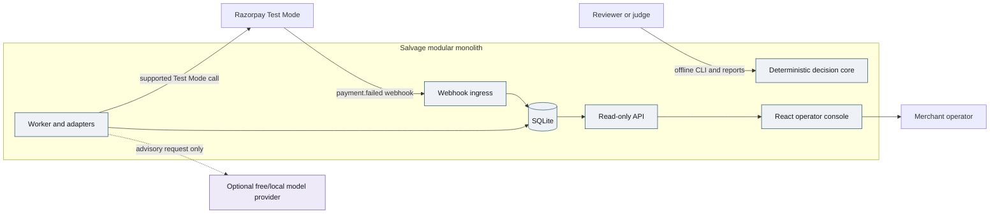
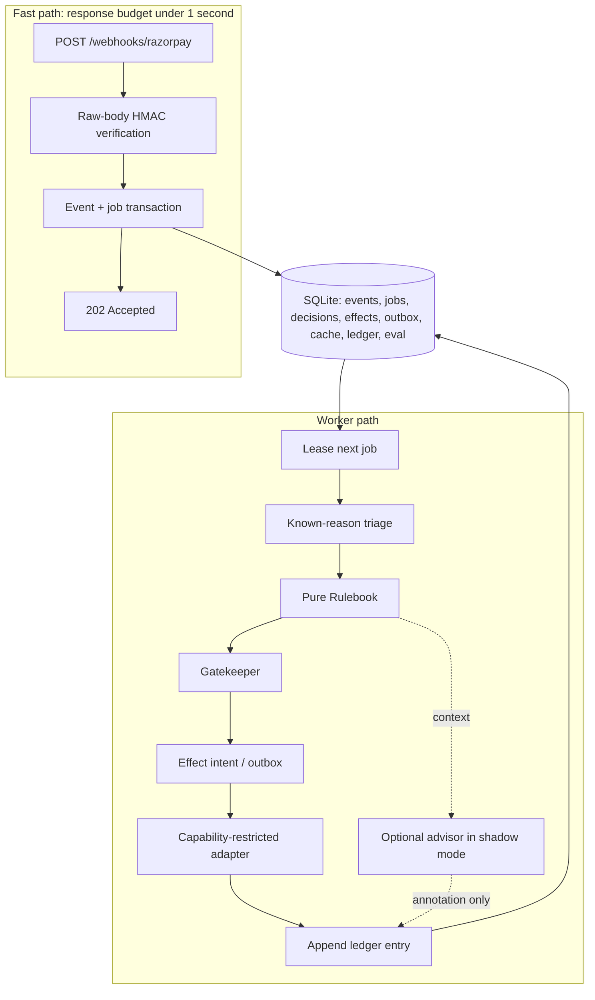

# Architecture

Status: Accepted for MVP implementation

Last reviewed: 2026-08-29

## 1. Architectural thesis

Salvage is a modular monolith with a read-only web console. One Python process
receives webhooks and serves the API; a separate invocation of the same Python
package leases and processes SQLite jobs. React renders stored results and
contains no payment policy.

The executable path is deterministic:

> authenticated event → known-reason triage → Rulebook decision → Gatekeeper
> validation → idempotent effect intent → constrained adapter

Model output is an annotation on that path, not an input to execution.

## 2. System context



## 3. Trust boundaries

1. **Internet to ingress:** untrusted raw bytes and headers cross into the
   application. Authenticate before parsing.
2. **Application to external APIs:** only fixed, configured Razorpay/Ollama/Groq
   origins are permitted. Inputs are allowlisted and time-bounded.
3. **Application to SQLite:** all mutation occurs through explicit transactions,
   parameterized SQL, constraints, and migrations.
4. **Read API to browser:** all database content is untrusted display data.
   React escapes text; no raw HTML from providers or webhooks is rendered.
5. **Developer environment to configuration:** secrets exist only in ignored
   environment files or process environment, never fixtures, logs, reports, or
   model caches.

See `security/threat-model.md` for the threat register.

## 4. Container view



### Deployment units

- `salvage-api`: FastAPI/Uvicorn process for webhook and read endpoints.
- `salvage-worker`: CLI worker loop from the same Python package.
- `salvage-console`: Vite-built static files, served by FastAPI in demo mode or
  a local static server during development.
- `salvage` CLI: doctor, migrate, demo, seed, work, eval, report, verify-ledger.

They share code and one SQLite database in the MVP. They are not separately
deployed microservices.

## 5. End-to-end event sequence

```mermaid
sequenceDiagram
    autonumber
    participant R as Razorpay
    participant I as Ingress
    participant D as SQLite
    participant W as Worker
    participant P as Policy
    participant A as Advisor
    participant G as Gatekeeper
    participant X as Adapter

    R->>I: payment.failed + signature + event id
    I->>I: verify HMAC over exact raw bytes
    I->>D: INSERT event and job in one transaction
    alt first delivery
        D-->>I: inserted
    else duplicate event id
        D-->>I: existing event
    end
    I-->>R: 202 Accepted
    W->>D: atomically lease queued job
    W->>P: reason + stored state + injected now + policy version
    P-->>W: effective class + allowed set + deterministic action
    opt advisor configured
        W->>A: redacted facts + closed advisory schema
        A-->>W: suggestion / wording
        W->>W: validate and store as annotation
    end
    W->>G: deterministic action + fresh stored facts
    G-->>W: approve or reject with check results
    W->>D: create unique effect intent and ledger entry
    opt adapter capability enabled
        W->>X: effect intent + idempotency key
        X-->>W: external reference or failure
        W->>D: append outcome; update intent state
    end
```

## 6. Components and responsibilities

### 6.1 Ingress

Responsibilities:

- read the raw request body once;
- require `X-Razorpay-Signature` and `x-razorpay-event-id`;
- compute HMAC-SHA256 with the configured webhook secret and compare in constant
  time;
- parse JSON only after authentication;
- allowlist relevant fields into an ingress-event projection;
- hash the raw payload but do not retain it outside controlled test fixtures;
- insert the event and one job in a single immediate transaction;
- return 202 for both first and duplicate valid deliveries;
- return 4xx for missing/invalid authentication before persistence.

It must not run policy, call a model, call Razorpay APIs, or render a report.

### 6.2 Job queue and worker

SQLite is the durable queue. A worker claims a job with one atomic update that
sets `state=leased`, `lease_owner`, and `lease_expires_at`. Expired leases are
recoverable. Processing attempts are bounded; terminal failure becomes
`dead_letter` and creates an operator escalation.

The worker is single-concurrency by default. Tests still simulate concurrent
claimers to prove the lease and unique constraints work.

### 6.3 Triage

Triage loads versioned YAML and validates it at startup. A mapping entry
contains reason, class, rationale, source reference, review state, and optional
source/step restrictions. The normalized map is fingerprinted.

- Known approved reason: use its configured class.
- Risk source or explicit hard-stop signal: effective Class D regardless of
  reason mapping.
- Unknown, ambiguous, or invalid entry: effective Class D and review required.
- Advisory classification may be recorded separately but cannot change the
  effective class.

### 6.4 Rulebook

The Rulebook is a pure function:

```text
decide(payment_state, effective_class, policy, now) -> PolicyDecision
```

Inputs include attempt/contact counts, prior effects, timestamps, manual stop
state, adapter capabilities, policy version, and injected current time. Output
includes allowed actions, deterministic default action, reason codes, next
eligible time, and policy fingerprint.

It performs no I/O and reads no global clock or environment variable.

### 6.5 Advisor

The Advisor is an optional anti-corruption layer over provider APIs. Supported
tasks are:

- `suggest_class` for unknown reasons in shadow mode;
- `draft_operator_explanation`;
- `draft_customer_copy` for an already deterministic Class B/C message intent;
- `summarize_batch`.

Inputs are redacted and task-specific. Outputs are Pydantic-validated. Invalid
output gets one bounded repair attempt only where configured, then provider
fallback, then deterministic omission. No advisory failure blocks the job.

### 6.6 Gatekeeper

The Gatekeeper re-reads stored facts and records each check:

1. action belongs to the Rulebook allowed set;
2. effective class is not a hard stop for the action;
3. attempt count remains below cap;
4. cooldown has elapsed;
5. contact count remains below both payment and customer-window caps;
6. payment/customer is not on the manual stop list;
7. adapter declares the capability;
8. amount/currency equal stored immutable payment facts where relevant;
9. action is not a prohibited type such as refund, credit, or discount.

Any failure converts the effect to operator escalation/no action. Rejection is
not silently replaced with a more aggressive fallback.

### 6.7 Effect intents and adapters

The database is the source of truth for intended effects. The idempotency key is
a SHA-256 digest over versioned canonical fields such as payment ID, action,
policy decision ID, and policy-counted attempt number.

MVP adapters:

- `dry_run`: records all supported action types without network calls.
- `razorpay_test`: allows only explicitly implemented Test Mode operations.
- `outbox`: stores customer/operator messages; no real transport is enabled.

There is no live adapter. Unsupported automatic retries remain dry-run or
simulated evaluation effects.

### 6.8 Ledger

Each decision stage appends canonical JSON with:

- sequence and event/decision IDs;
- input and output summaries;
- reason-map, policy, schema, and prompt fingerprints;
- effective and advisory classes;
- allowed set and deterministic action;
- Gatekeeper checks;
- effect/outbox outcomes;
- previous entry hash and current entry hash.

The chain detects modification of retained entries. It does not prevent an
administrator from deleting or replacing the entire database, so reports must
say “tamper-evident,” not “immutable.” Evaluation additionally computes a
decision hash that excludes non-deterministic operational timestamps.

### 6.9 Read API and console

The console calls only GET endpoints. No CORS wildcard is needed in the demo
profile because FastAPI can serve the static build from the same origin.
Provider rationale, failure descriptions, and operator fields render as text.
The console never uses `dangerouslySetInnerHTML`.

## 7. Data model

All times are UTC ISO-8601 values in storage/API. Money is integer minor units.
Foreign keys are enabled. Migrations set WAL mode and a bounded busy timeout.

| Table               | Key fields and constraints                                                                | Purpose                                                |
| ------------------- | ----------------------------------------------------------------------------------------- | ------------------------------------------------------ |
| `schema_migrations` | `version` primary key                                                                     | Applied SQL migration history.                         |
| `ingress_events`    | `event_id` primary key; payload digest; allowlisted Razorpay fields                       | Authenticated delivery deduplication and source facts. |
| `jobs`              | `job_id`; `event_id` unique; state; lease; bounded attempt count                          | Durable work queue.                                    |
| `payment_state`     | `payment_id` primary key; counts; last-effect times; stop flag                            | Current deterministic policy state.                    |
| `decisions`         | `decision_id`; `event_id` unique; fingerprints; effective/advisory class; selected action | One logical decision per event.                        |
| `gate_checks`       | `(decision_id, check_name)` unique                                                        | Explainable Gatekeeper evidence.                       |
| `effect_intents`    | `idempotency_key` unique; decision/action/state/external ref                              | Effectively-once effect tracking.                      |
| `outbox_messages`   | `message_id`; effect key unique; rendered text; transport state                           | Pluggable, disabled-by-default communication.          |
| `llm_cache`         | `cache_key` primary key; task/provider/model/schema/prompt/input digests                  | Validated advisory cache with provenance.              |
| `ledger_entries`    | monotonic `sequence`; `entry_hash` unique; `prev_hash`                                    | Tamper-evident audit chain.                            |
| `eval_batches`      | batch ID; seed; fixture/policy versions; fixed clock                                      | Reproducible evaluation identity.                      |
| `eval_scenarios`    | batch/scenario key; visible facts; encrypted-by-separation hidden truth reference         | Same inputs for all policies.                          |
| `eval_results`      | batch/policy/scenario key; actions/outcomes/metrics                                       | Counterfactual result data.                            |

Hidden truth is represented in a separate evaluator object/file and is not
passed to policy functions. A test must fail if a policy-facing schema gains a
hidden-truth field.

## 8. Transaction boundaries

### Webhook transaction

1. Insert `ingress_events` with `ON CONFLICT DO NOTHING`.
2. If inserted, insert the unique job.
3. Commit.
4. Return 202.

### Decision transaction

1. Re-read event and payment state.
2. Compute triage, policy, and Gatekeeper outside the write transaction.
3. Begin immediate transaction and verify the state version has not changed.
4. Insert decision, checks, unique effect intent/outbox row, state update, and
   ledger entry.
5. Mark job completed and commit.

State-version mismatch aborts and retries computation. This prevents stale
concurrent decisions from exceeding caps.

### External-call window

External calls occur after the effect intent is committed. A crash may leave an
intent in `pending` or `in_flight`; recovery reuses the same idempotency key.
Exactly-once network delivery is not claimed.

## 9. API surface

### Webhook

- `POST /webhooks/razorpay` — authenticated ingestion; returns 202 after durable
  event/job storage.

### Health

- `GET /health/live` — process is running.
- `GET /health/ready` — schema current, database writable, policy/map valid.

### Read-only operator API

- `GET /api/v1/decisions`
- `GET /api/v1/decisions/{decision_id}`
- `GET /api/v1/escalations`
- `GET /api/v1/batches`
- `GET /api/v1/batches/{batch_id}/results`
- `GET /api/v1/ledger/status`
- `GET /api/v1/meta/versions`

Pagination is cursor-based. API response schemas are Pydantic models and feed
the generated TypeScript definitions. Mutation endpoints are out of scope.

## 10. Command-line interface

| Command                 | Behavior                                                                                                                 |
| ----------------------- | ------------------------------------------------------------------------------------------------------------------------ |
| `salvage doctor`        | Validate runtimes, schema, policy/map, writable paths, and optional provider settings without mutating external systems. |
| `salvage migrate`       | Apply local SQLite migrations.                                                                                           |
| `salvage demo`          | Rebuild deterministic demo data, run all policies, write JSON/static report, and print final hashes offline.             |
| `salvage seed`          | Create Razorpay Test Mode scenarios only after explicit sandbox configuration.                                           |
| `salvage work`          | Process queued jobs once or as a loop.                                                                                   |
| `salvage eval`          | Run batch comparison and sensitivity sweep.                                                                              |
| `salvage report`        | Render static HTML from an existing result object.                                                                       |
| `salvage verify-ledger` | Verify the chain and report the first mismatch.                                                                          |

## 11. Planned repository layout

```text
/
├── src/salvage/
│   ├── api/                 # FastAPI routes and response models
│   ├── ingress/             # raw-body verification and event projection
│   ├── domain/              # classes, actions, policy, gatekeeper
│   ├── advisory/            # provider adapters, schemas, cache keys
│   ├── persistence/         # sqlite connection, queries, migrations
│   ├── execution/           # effect intents and constrained adapters
│   ├── audit/               # canonical encoding and hash chain
│   ├── evaluation/          # generator, policies, scorer, sensitivity
│   └── cli.py
├── policy/
│   ├── reason-map.yaml
│   ├── recovery-policy.yaml
│   └── schemas/
├── migrations/
├── fixtures/
│   ├── webhooks/
│   ├── golden-decisions.yaml
│   ├── evaluation/
│   └── advisory-cache/
├── tests/
│   ├── unit/
│   ├── property/
│   ├── integration/
│   ├── contract/
│   ├── replay/
│   ├── adversarial/
│   └── sandbox/
├── console/
│   ├── src/
│   ├── tests/
│   └── e2e/
└── docs/
```

This is a single product context, not a distributed or multi-package domain
monorepo. Python and console lockfiles remain separate because they use
different ecosystems.

## 12. Runtime profiles

### Offline demo — default

- generated local SQLite database;
- committed fixtures and validated advisory cache;
- `SALVAGE_LLM=off` or cache-only;
- dry-run adapters;
- no network, secrets, or real customer data.

### Local development

- API and worker run separately;
- Vite dev server may proxy `/api` to FastAPI;
- optional local Ollama;
- synthetic fixtures.

### Razorpay sandbox evidence

- Test Mode credentials only;
- public HTTPS endpoint through `zrok2` as recommended by current Razorpay
  webhook testing guidance;
- minimum event subscription;
- effect capability allowlist;
- no real notification transport.

There is no production profile.

## 13. Observability

Structured logs include correlation ID, event ID, job ID, decision ID, effect
key, stage, duration, and outcome. They exclude raw webhook bodies, secrets,
full customer identifiers, and model prompts containing external descriptions.

Counters required for the MVP:

- webhooks accepted, rejected, and deduplicated;
- webhook handling latency;
- jobs queued, leased, retried, completed, dead-lettered;
- known vs unknown reasons;
- Gatekeeper approvals/rejections by check;
- effect and outbox states;
- advisory cache hits, validation failures, provider fallbacks;
- ledger verification status;
- evaluation metrics and fallback rate.

## 14. Failure behavior

| Failure                            | Required behavior                                                                     |
| ---------------------------------- | ------------------------------------------------------------------------------------- |
| Invalid signature                  | Reject before parsing/persistence; log metadata only.                                 |
| Duplicate event                    | Return 202; create no new job/decision/effect.                                        |
| Out-of-order event                 | Reconcile by stored state/version; never assume arrival order.                        |
| SQLite busy                        | Retry only within the fast-path budget; otherwise return failure so Razorpay retries. |
| Worker crash                       | Lease expires; next worker resumes with the same logical keys.                        |
| Unknown reason                     | Effective Class D; optional shadow suggestion; no automated effect.                   |
| Policy/map invalid                 | Readiness fails and worker stops; no permissive default.                              |
| Model timeout/429/malformed output | Cache/provider fallback, then omit advice; decision continues.                        |
| Gatekeeper rejection               | Record rejection and escalate; no aggressive substitute.                              |
| External 5xx/timeout               | Keep intent retryable with bounded attempts and same idempotency key.                 |
| Test capability absent             | Keep dry-run intent and report limitation.                                            |
| Ledger mismatch                    | Mark audit status failed and stop release/demo success.                               |

## 15. Architecture quality checks

Implementation is inconsistent with this architecture if it introduces model
output into `PolicyDecision`, performs slow work in the webhook request, stores
money as floating point, makes the console mutate payment state, calls a live
API, uses an unbounded retry, or bypasses effect-intent uniqueness.
