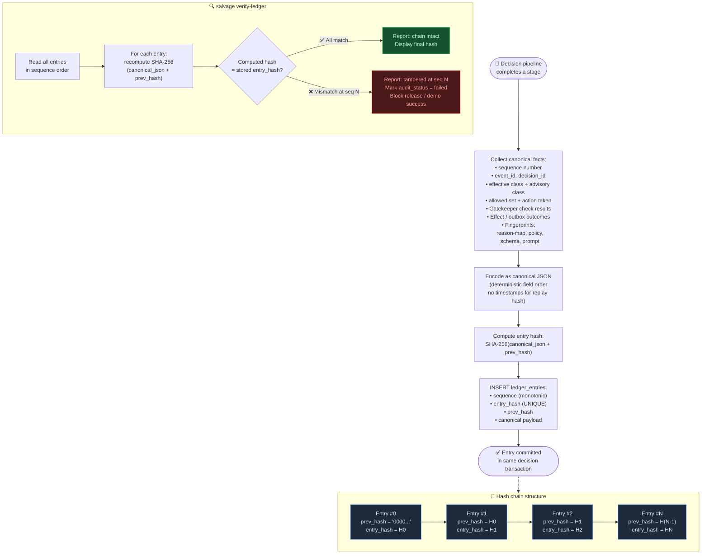

# Flow: Audit Ledger & Hash Chain

**Component:** `src/salvage/audit/` · CLI: `salvage verify-ledger`

The ledger is append-only by application contract. Each entry carries a SHA-256
hash of its canonical content chained to the previous entry's hash. This makes
silent alteration of retained entries detectable without requiring a distributed
consensus system.



## Entry content

Each ledger entry contains:

```json
{
  "sequence": 42,
  "event_id": "evt_...",
  "decision_id": "dec_...",
  "effective_class": "B",
  "advisory_class": "B",
  "allowed_actions": ["schedule_retry"],
  "deterministic_action": "schedule_retry",
  "gatekeeper_checks": {
    "in_allowed_set": true,
    "class_not_hard_stop": true,
    "attempt_cap": true,
    "cooldown_elapsed": true,
    "contact_cap": true,
    "not_on_stop_list": true,
    "adapter_capability": true,
    "amount_currency_match": true,
    "not_prohibited_type": true
  },
  "effect_outcome": "dry_run_recorded",
  "fingerprints": {
    "reason_map": "sha256:abc...",
    "policy": "sha256:def...",
    "schema": "sha256:ghi..."
  },
  "prev_hash": "sha256:...",
  "entry_hash": "sha256:..."
}
```

## Tamper-evidence scope

| Scenario | Detected? |
|----------|-----------|
| Single entry field modified | ✅ Yes — hash mismatch |
| Entry deleted from middle | ✅ Yes — sequence gap + hash chain break |
| Entry appended with wrong prev_hash | ✅ Yes — chain break |
| Entire database replaced | ❌ No — ledger says "tamper-evident", not "immutable" |

## Decision hash (evaluation)

A separate **decision hash** is computed for evaluation replay. It excludes
non-deterministic operational timestamps so that the same seed, reason-map, and
policy version always produce the same hash regardless of wall-clock time.

## Related flows

- [Worker pipeline](./worker-pipeline.md) — appends entries after each stage
- [Evaluation flow](./evaluation-flow.md) — verifies decision hash on replay
