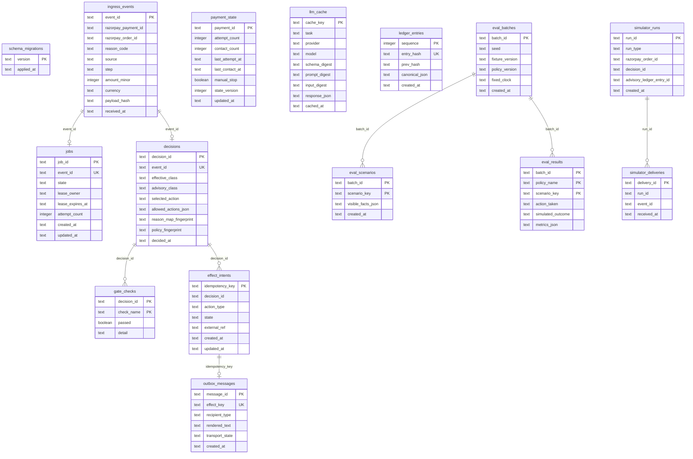

# Data Model

**Storage:** SQLite with WAL mode, foreign keys enabled, bounded busy timeout.
**All times:** UTC ISO-8601. **Money:** integer minor units only — never floating point.

## Entity relationship diagram

## Database isolation

| Database file | Purpose | Isolated from |
|---------------|---------|---------------|
| `data/salvage.db` | Core: webhooks, jobs, decisions, ledger, eval | Simulator, playground |
| `data/salvage-simulator.db` | Connected simulator runs + deliveries | Core, playground |
| `data/salvage-playground.db` | Local playground dry-run tests | Core, simulator |

## Key constraints

| Constraint | Table | Enforcement |
|-----------|-------|-------------|
| One job per event | `jobs.event_id` UNIQUE | `ON CONFLICT DO NOTHING` on ingress |
| One decision per event | `decisions.event_id` UNIQUE | Prevents duplicate processing |
| Idempotent effects | `effect_intents.idempotency_key` UNIQUE | SHA-256 of stable canonical fields |
| Monotonic ledger | `ledger_entries.sequence` monotonic | Application enforced |
| Non-duplicate hash | `ledger_entries.entry_hash` UNIQUE | Detects replay tampering |
| Integer money | `amount_minor` INTEGER | Schema-level type constraint |

## Related flows

- [Worker pipeline](./worker-pipeline.md) — writes to most tables
- [Webhook ingress](./webhook-ingress.md) — writes `ingress_events` + `jobs`
- [Audit ledger](./audit-ledger.md) — writes `ledger_entries`
- [Evaluation flow](./evaluation-flow.md) — writes `eval_*` tables
