# Flow: Evaluation & Policy Comparison

**Component:** `src/salvage/evaluation/` · CLI: `salvage eval` + `salvage report`

The evaluator runs three policies against an identical seeded batch of synthetic
scenarios, compares them against a **hidden ground truth** that no policy
function ever sees, applies a ±30% assumption sensitivity sweep, and writes
reproducible JSON results with a deterministic decision hash.

```mermaid
flowchart TD
    A(["📁 Seed fixture\n(YAML scenarios\n+ hidden truth file)"]) --> B

    B["salvage demo / salvage eval\nLoad seed, generate eval_batch\nRecord: seed, fixture version\npolicy version, fixed clock"]
    B --> C["Generate eval_scenarios\nVisible facts only →\npassed to policy functions\nHidden truth stored separately"]

    C --> D

    subgraph POLICIES["🔄 Three policies run on same inputs"]
        direction LR
        P1["Policy: Salvage\n(full reason-map\n+ Rulebook)"]
        P2["Policy: Blind retry\n(retry everything\nno classification)"]
        P3["Policy: No-op\n(never retry)"]
    end

    D --> POLICIES

    POLICIES --> E["Collect eval_results\nper policy/scenario:\n• action taken\n• simulated outcome\n• metrics"]

    E --> F["🔍 Compare against\nhidden ground truth\n(separate evaluator object\nnever passed to policy)"]

    F --> G["Compute metrics:\n• Recovery rate\n• Wasted attempts\n• Class D violations\n• Decision hash (deterministic)"]

    G --> SWEEP

    subgraph SWEEP["📊 ±30% Sensitivity sweep"]
        SWEEP1["Vary key assumptions:\n• Recovery probability\n• Customer behavior curves\n• Timing parameters"]
        SWEEP1 --> SWEEP2["Re-run all policies\nfor each assumption variant"]
        SWEEP2 --> SWEEP3["Collect sensitivity\nresult envelope"]
    end

    SWEEP3 --> H["Write reports/results.json\nIncluding:\n• All policy results\n• Sensitivity envelope\n• Assumption inputs (visible)\n• Decision hash"]

    H --> I["salvage report\nRender reports/report.html\nfrom results.json\n(static, portable)"]

    H --> J["salvage verify-ledger\nVerify hash chain\nCheck decision replay\nhash matches stored value"]

    I --> K(["✅ Showcase:\nrecovery uplift visible\nzero Class D violations\ndeterministic hash matches"])
    J --> K

    style K fill:#14532d,stroke:#22c55e,color:#bbf7d0
    style SWEEP1 fill:#1c2a3a,stroke:#3b82f6,color:#e2e8f0
    style SWEEP2 fill:#1c2a3a,stroke:#3b82f6,color:#e2e8f0
    style SWEEP3 fill:#1c2a3a,stroke:#3b82f6,color:#e2e8f0
```



## Isolation guarantees

```
eval_scenarios (visible facts) ──► policy function ──► eval_results
                                                             │
hidden truth file ────────────────────────────────────────► comparator
                                                             │
                                                          metrics
```

A test must fail if any policy-facing schema gains a hidden-truth field.

## Current seeded results

| Metric | Salvage | Blind retry | No-op |
|--------|---------|-------------|-------|
| Synthetic recovery rate | **50.6%** | 36.8% | 0% |
| Wasted attempts avoided | **79%** fewer | baseline | n/a |
| Class D violations | **0** | multiple | 0 |

> These are counterfactual demo results with visible assumptions, not claims of real-world uplift.

## Related flows

- [Worker pipeline](./worker-pipeline.md) — same pipeline used for evaluation runs
- [Audit ledger](./audit-ledger.md) — decision hash verified by `salvage verify-ledger`
