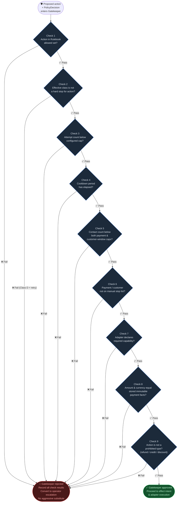

# Flow: Gatekeeper Checks

**Component:** `src/salvage/domain/` (gatekeeper module)

The Gatekeeper is an independent safety layer that re-reads stored facts and
validates a proposed deterministic action through nine sequential checks. A
single failure converts the effect to an operator escalation. Rejection is never
silently replaced with a more aggressive fallback.

## Check reference table

| # | Check | What is verified | Failure result |
|---|-------|-----------------|----------------|
| 1 | Allowed set | Action is in `PolicyDecision.allowed_actions` | Escalation |
| 2 | Hard-stop class | Effective class does not prohibit this action type | Escalation |
| 3 | Attempt cap | `payment_state.attempt_count < policy.max_attempts` | Escalation |
| 4 | Cooldown | `now >= last_attempt_at + policy.cooldown` | Escalation |
| 5 | Contact cap | Both per-payment and per-customer-window limits respected | Escalation |
| 6 | Stop list | `payment_state.manual_stop = false` | Escalation |
| 7 | Adapter capability | Adapter's declared capability set includes action type | Keep dry-run |
| 8 | Amount/currency | Match stored immutable facts (money as integer minor units) | Escalation |
| 9 | Prohibited type | Not a refund, credit, discount, or live payment | Escalation |

## Key guarantees

- **No silent substitution:** A rejected action is never replaced with a harsher fallback.
- **Evidence always recorded:** Every check result is stored in `gate_checks` with its outcome.
- **Re-reads fresh state:** Gatekeeper reads from the database again, not from in-memory computation, preventing race conditions.
- **Class D invariant:** Check 2 makes it structurally impossible for a Class D decision to produce an automated effect.

## Related flows

- [Worker pipeline](./worker-pipeline.md) — Gatekeeper sits after Rulebook
- [Triage decision](./triage-decision.md) — produces effective class consumed by Check 2
