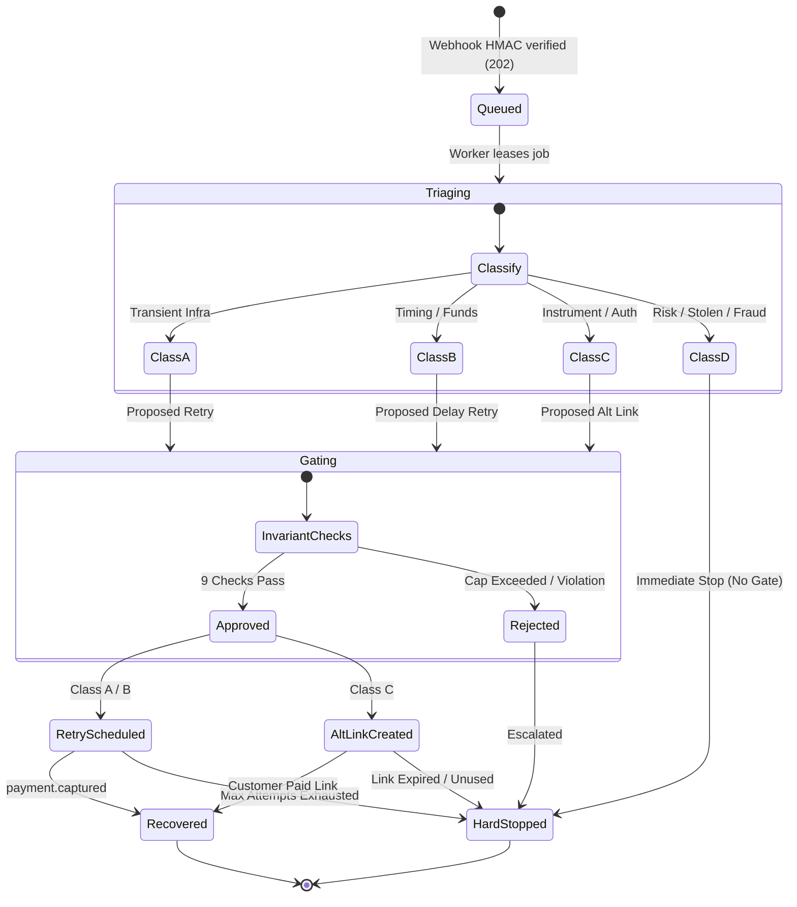

# Payment Recovery Lifecycle Flow

Interactive showcase: [Interactive Lifecycle Diagram (HTML)](html/payment-lifecycle.html)
Specification: [Archify Lifecycle Spec (JSON)](specs/payment-lifecycle.lifecycle.json)

## Overview

The payment recovery lifecycle models the complete state transitions of a failed payment from initial failure reception through triage, evaluation, execution, and terminal resolution.

## Action Classes Breakdown
- **Class A**: Exponential backoff retry with strict attempt cap.
- **Class B**: Scheduled delayed retry for funds clearing.
- **Class C**: Single alternative payment link generated.
- **Class D**: Deterministic hard stop with operator escalation.
