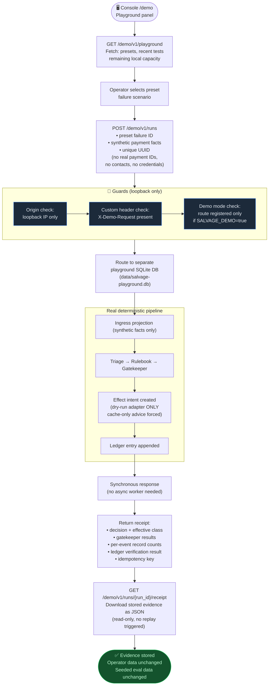

# Flow: Local Synthetic Playground

**Component:** `src/salvage/api/` (demo routes) · API: `POST /demo/v1/runs`

> **Offline, local-only.** No network, no provider key, no Razorpay account
> required. Uses a separate database (`data/salvage-playground.db`). Only
> available when the API runs in demo mode. Seeded evaluation data is never
> modified by a playground test.

The playground is a bounded synchronous test runner for the local operator.
It submits preset synthetic failures through the real deterministic pipeline
and returns a receipt with the actual decision, ledger verification, and
per-event record counts.

## Isolation guarantees

| Constraint | Enforcement |
|------------|-------------|
| Separate database | `data/salvage-playground.db` never touches `salvage.db` |
| Dry-run effects only | `dry_run` adapter forced; no network calls |
| Cache-only advice | `SALVAGE_LLM=cache-only` forced for playground routes |
| No real payment IDs | Input schema rejects Razorpay-format IDs |
| Loopback only | Route middleware checks `request.client.host` |
| No operator data change | Playground DB is separate; operator tables untouched |

## API surface (demo mode only)

| Endpoint | Method | Purpose |
|----------|--------|---------|
| `/demo/v1/playground` | `GET` | Presets, recent tests, remaining capacity |
| `/demo/v1/runs` | `POST` | Submit a synthetic failure and get decision |
| `/demo/v1/runs/{run_id}/receipt` | `GET` | Download stored evidence JSON |

## Related flows

- [Worker pipeline](./worker-pipeline.md) — same pipeline, synchronous in playground
- [Simulator flow](./simulator-flow.md) — the opt-in connected alternative
- [Evaluation flow](./evaluation-flow.md) — batch evaluation (separate from playground)
