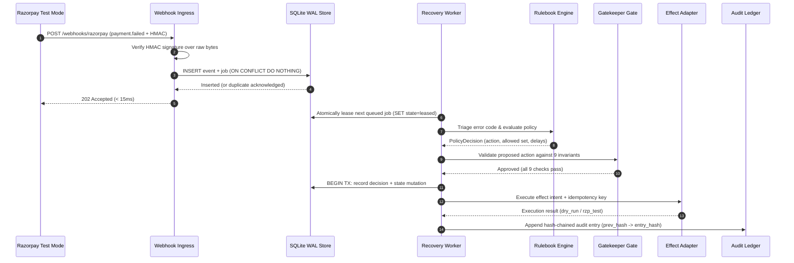

# End-to-End Payment Recovery Sequence Flow

Interactive showcase: [Interactive Sequence Diagram (HTML)](html/recovery-sequence.html)
Specification: [Archify Sequence Spec (JSON)](specs/recovery-sequence.sequence.json)

## Overview

The end-to-end recovery sequence details the timeline and ownership boundaries from the initial `payment.failed` webhook delivery to final ledger sealing.

## Key Invariants in Sequence
- **Sub-second ACK**: Fast path returns 202 before slow processing begins.
- **Atomic Lease**: Multiple worker instances cannot lease the same job concurrently.
- **Deterministic Evaluation**: Pure rulebook has zero network or clock dependencies.
- **Pre-execution Gate**: Gatekeeper re-reads state to guarantee fresh checks before execution.
