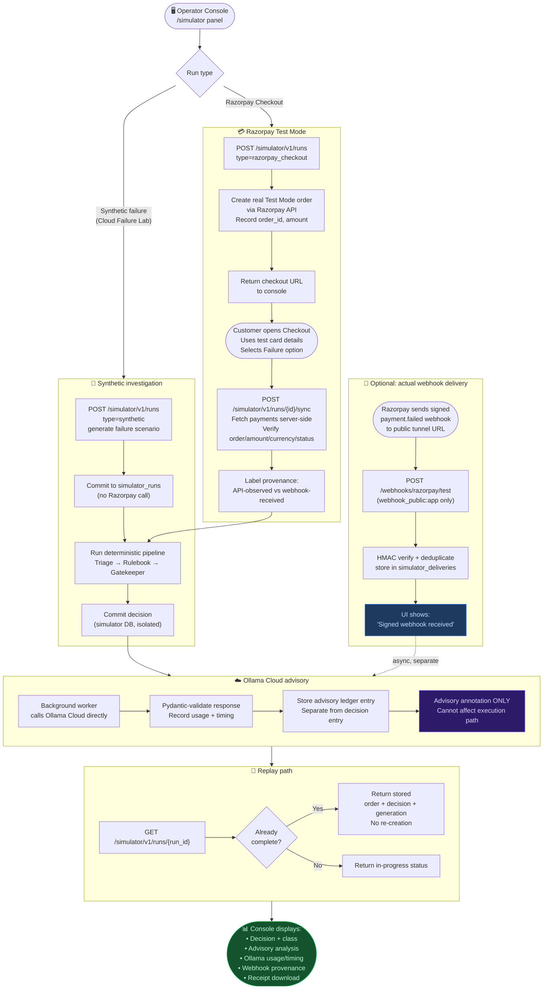

# Flow: Connected Cloud Simulator

**Component:** `src/salvage/simulator/` · API: `POST /simulator/v1/runs`

> **Opt-in only.** Requires `SALVAGE_SIMULATOR_ENABLED=true`, valid Ollama Cloud
> API key, and Razorpay Test Mode credentials. Uses a separate SQLite database
> (`data/salvage-simulator.db`). All recovery effects remain dry-run.

The connected simulator creates either a **synthetic failure investigation** (no
Razorpay call) or a **real Test Mode order** (Razorpay Checkout), runs it through
the deterministic pipeline, then calls Ollama Cloud for advisory analysis. A
replay path returns stored results without re-issuing any external request.

## Isolation boundaries

| Database | Contents | Isolated from |
|----------|----------|---------------|
| `data/salvage.db` | Seeded evaluation, offline demo | All simulator data |
| `data/salvage-simulator.db` | Simulator runs, deliveries, advisory | Seeded results, playground |
| `data/salvage-playground.db` | Local playground dry-run tests | Operator data |

## Limits

- Max 200 simulator runs (local)
- Max 30 Razorpay Test Mode order attempts
- Tunnel (zrok) exposes **only port 8002** — never the main API or Ollama service

## Related flows

- [Webhook ingress](./webhook-ingress.md) — the `/webhooks/razorpay/test` path
- [Worker pipeline](./worker-pipeline.md) — same core pipeline used inside simulator
- [Playground flow](./playground-flow.md) — offline-only alternative
