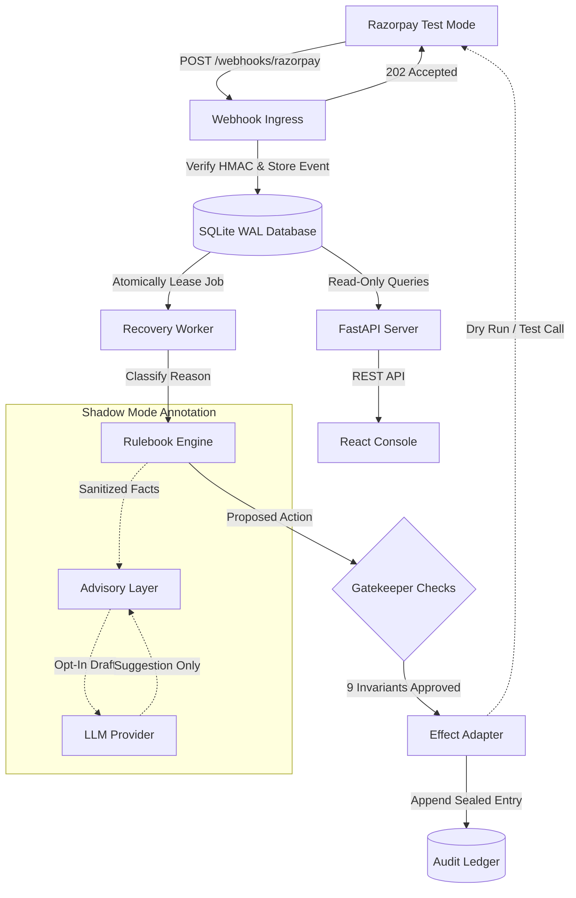

# System Architecture Flow

Interactive showcase: [Interactive Architecture Diagram (HTML)](html/system-architecture.html)
Specification: [Archify Architecture Spec (JSON)](specs/system-architecture.architecture.json)

## Overview

The Salvage recovery architecture enforces strict boundary separation between:
1. **Webhook Ingress & Storage** (fast path: HMAC verification, durable SQLite enqueue, immediate 202 Accepted)
2. **Deterministic Decision Core** (worker lease, reason triage, pure Rulebook evaluation, independent Gatekeeper, effect adapter, hash-chained audit ledger)
3. **Advisory Boundary (Opt-In)** (LLM model provider running in shadow mode with zero action authority)
4. **Read-Only Operator Surface** (FastAPI REST API and React Operator Console)

## Related Documentation
- [Architecture Overview](../architecture.md)
- [Gatekeeper Safety Checks](gatekeeper-checks.md)
- [Audit Ledger & Hash Chain](audit-ledger.md)
