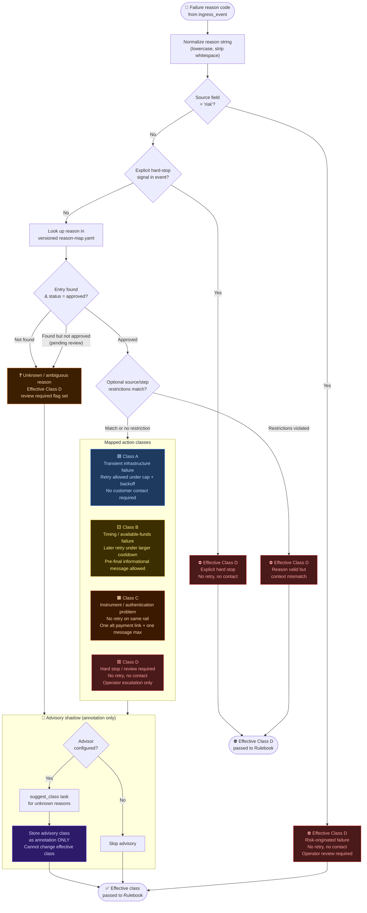

# Flow: Triage & Action Class Decision

**Component:** `src/salvage/domain/` + `policy/reason-map.yaml`

Triage maps a raw Razorpay failure reason code to one of four merchant action
classes. The mapping is owned by a versioned YAML file, validated at startup,
and fingerprinted. The model may suggest a class in shadow mode for unknown
reasons but **cannot change the effective class**.



## Reason map entry schema

```yaml
# policy/reason-map.yaml
- reason: "insufficient_funds"
  class: B
  rationale: "Customer account lacks funds; retry after cooldown may succeed."
  source_ref: "Razorpay error code docs §4.2"
  review_state: approved
  # optional:
  source_restrictions: []   # e.g. ["payment"] — restrict to specific event sources
  step_restrictions: []     # e.g. ["charge"] — restrict to specific payment steps
```

## Class summary

| Class | Cause | Retry | Contact | Stop |
|-------|-------|-------|---------|------|
| **A** | Transient infrastructure | ✅ Capped + backoff | ❌ | Auto after cap |
| **B** | Timing / funds | ✅ Later, large cooldown | ⚠️ Pre-final only | Auto after cap |
| **C** | Instrument / auth | ❌ Same rail | ⚠️ One message max | Immediate |
| **D** | Risk / unknown / hard-stop | ❌ | ❌ | Immediate |

## Related flows

- [Worker pipeline](./worker-pipeline.md) — triage sits inside the worker
- [Gatekeeper checks](./gatekeeper-checks.md) — enforces class constraints downstream
