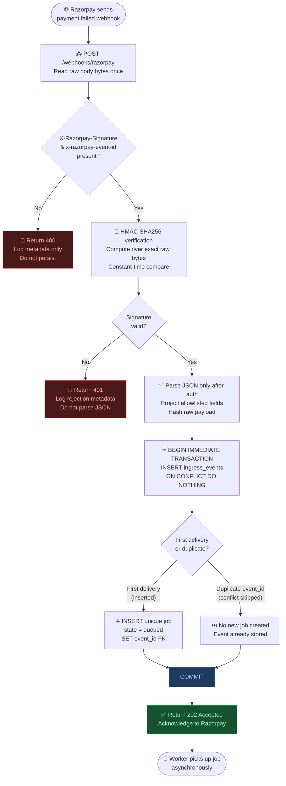

# Flow: Webhook Ingress

**Path:** Fast path — response budget under 1 second.

This flow describes how a raw Razorpay `payment.failed` webhook is received,
authenticated, deduplicated, and durably enqueued before the 202 response is
returned. No policy, model, or Razorpay API call occurs in this path.

## Key invariants enforced here

| Invariant | Enforcement point |
|-----------|-------------------|
| Authenticate before parse | HMAC checked before `json.loads()` |
| Idempotent delivery | `ON CONFLICT DO NOTHING` on `event_id` |
| Durability before 202 | Transaction committed before response |
| Raw bytes never retained | Only hash stored, not body |
| No slow work in fast path | Policy/model/API calls happen in worker |

## Related flows

- [Worker pipeline](./worker-pipeline.md) — processes the queued job
- [Gatekeeper checks](./gatekeeper-checks.md) — downstream safety validation
