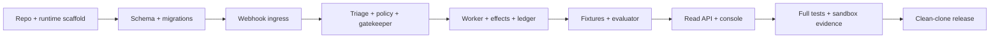

# MVP implementation plan

- **Plan date:** 2026-08-29
- **Target release candidate:** 2026-09-03
- **Buildathon deadline:** 2026-09-05
- **Budget:** approximately 30 focused hours

## 1. Outcome

By the release-candidate date, a reviewer can clone the personal repository, run
one offline command, see the three-policy evaluation and decision report, run
the full safety suite, and inspect a real Razorpay Test Mode webhook evidence
run without any claim that simulated outcomes are real.

## 2. Scope lock

### Must ship

- Personal GitHub repository under `rajpaladitiya` only.
- Python modular monolith, SQLite migrations/queue, and CLI.
- Raw-byte webhook verification, event dedupe, fast 202, and worker.
- Reviewable reason map with a useful known subset.
- Deterministic Rulebook/Gatekeeper and fail-closed unknown reasons.
- Intent-first dry-run/Test Mode effects and outbox.
- Hash-chained audit ledger and verifier.
- Provider-off path plus optional advisory adapter/cache.
- Seeded three-policy evaluator, JSON/static report, and sensitivity sweep.
- Read-only React console with Vitest/jsdom tests.
- Playwright full-story and accessibility checks.
- Full documentation, incident log, and real-vs-simulated statement.

### Must not ship in MVP

- Live credentials, live payment calls, real notification delivery.
- Model-selected executable actions.
- Multi-user auth, distributed services, managed cloud database, paid hosting.
- Unreviewed claims of recovery uplift or legal compliance.
- A complete failure taxonomy at the expense of policy/test quality.

## 3. Critical path

Advisor/cloud work is off the critical path. The offline deterministic system
must work before any provider integration begins.

## 4. Work breakdown

| ID  | Work item               | Deliverable                                                                                              | Acceptance dependency              |
| --- | ----------------------- | -------------------------------------------------------------------------------------------------------- | ---------------------------------- |
| S0  | Repository foundation   | Git, personal remote, MIT license, ignore rules, runtime pins, uv/pnpm lockfiles, Makefile, CI skeleton. | `make doctor`; owner guard.        |
| S1  | Python/package scaffold | Layered package layout, typed settings/modes, CLI shell, health endpoints.                               | Ruff/mypy/unit smoke.              |
| S2  | SQLite foundation       | Migrations, connection/transaction helpers, generated demo DB, job leases.                               | PER-001/002/011/012.               |
| S3  | Webhook ingress         | Raw-body HMAC, projection, dedupe event+job transaction, 202 route.                                      | ING catalog and latency gate.      |
| S4  | Reason map and domain   | YAML schemas, fingerprints, known reason subset, classes/actions/state.                                  | TRI catalog and golden review.     |
| S5  | Rulebook/Gatekeeper     | Pure decision, provisional policy data, all gates/reason codes.                                          | 100% branch coverage + properties. |
| S6  | Worker/effects/outbox   | Lease loop, decision transaction, intent keys, dry-run/Test Mode capability interface.                   | PER and GAT catalog.               |
| S7  | Audit ledger            | Canonical JSON, append/verify, deterministic decision hash.                                              | AUD catalog.                       |
| S8  | Advisory layer          | Off/cache-only first, task schemas, optional Ollama/Groq HTTP adapters.                                  | ADV mandatory offline tests.       |
| S9  | Evaluation              | Generator, hidden truth separation, three policies, metrics, sensitivity, JSON/Jinja report.             | EVAL catalog.                      |
| S10 | Read API/contracts      | Decision/batch/ledger endpoints, OpenAPI artifact.                                                       | Contract tests + generated types.  |
| S11 | React console           | Decision cards, batch comparison, ledger status, filters, responsive CSS.                                | UIJ + E2E catalog.                 |
| S12 | Quality/security        | CI jobs, audits, secret scan, docs validation, CSP, redaction.                                           | Release gates.                     |
| S13 | Sandbox evidence        | zrok2 webhook, valid/duplicate/invalid, supported Test Mode operation.                                   | SBX evidence manifest.             |
| S14 | Submission packaging    | README result sections, incident, screenshots/video fallback, clean-clone drill.                         | Release checklist.                 |

## 5. Calendar plan

### Saturday, 29 August — documentation and repository (3 hours)

- Finalize source-of-truth docs and ADRs.
- Initialize Git and create private personal `rajpaladitiya/salvage` repository.
- Add license, ignores, runtime pins, empty issue roadmap, and protection
  against organization remotes.
- Define issue list from S0–S14.

Exit: docs pass local checks; repository destination verified.

### Sunday, 30 August — scaffold, storage, and webhook spike (5 hours)

- S0–S3: uv/Python scaffold, SQLite migrations/jobs, FastAPI route.
- Run one local signed fixture and measure latency.
- Prepare zrok/Razorpay Test Mode configuration without storing secrets.

Exit: valid/invalid/duplicate ingress tests pass and 202 path is under budget.

### Monday, 31 August — domain safety core (5 hours)

- S4–S5: reason-map subset, classes/actions, pure Rulebook, Gatekeeper.
- Write golden decisions, 100% branch tests, and Hypothesis invariants first.
- Lock unknown-reason and risk-source Class D behavior.

Exit: domain suite is green; no provider or UI dependency.

### Tuesday, 1 September — durable execution and audit (5 hours)

- S6–S8: worker leases, state-version transaction, intents, outbox, ledger,
  cache-only/off advisor.
- Inject crash windows and tampering.
- Optional one provider adapter only after offline tests pass.

Exit: replay creates one logical effect; ledger verifier detects alteration;
network-denied pipeline completes.

### Wednesday, 2 September — evaluator and console (5 hours)

- S9–S11: generator, hidden truth, three policies, metrics/sensitivity,
  `results.json`, static report, OpenAPI types, React console.
- Implement jsdom decision-state tests before polishing CSS.
- Add smallest Playwright full-story flow.

Exit: `make demo` produces report; console shows Class D refusal and batch
table.

### Thursday, 3 September — release candidate (4 hours)

- S12–S14: full CI-equivalent checks, Chromium E2E, security/secret scan,
  clean-clone drill, documentation sync.
- Attempt sandbox evidence with valid/duplicate/invalid flows.
- Capture stable fallback recording/screenshots after the run works.

Exit: release candidate tagged locally, all mandatory release gates pass.

### Friday, 4 September — buffer and pitch (2 hours)

- Fix only release-blocking defects.
- Cross-browser release suite.
- Record/cut pitch using real-vs-simulated and incident evidence.
- Review repository history before making it public if submission requires it.

### Saturday, 5 September — submit (1 hour)

- Verify public personal URL, signed-out access, clean clone, video link, and
  form answers.
- No architecture changes unless required to restore a broken release.

Total planned: 30 hours.

## 6. Implementation order inside each slice

1. Add/adjust schema or domain type.
2. Write failing unit/property/contract tests.
3. Implement smallest behavior.
4. Add integration/adversarial coverage.
5. Update docs/ADR if behavior changes.
6. Run focused tests, then `make check`.
7. Commit one reviewable slice referencing its issue.

Avoid building the polished console before evaluator result objects and API
contracts are stable.

## 7. Definition of done per work item

- Requirement and test-catalog IDs are referenced.
- Offline behavior has no unmocked network.
- New direct dependency is documented with license/cost and locked.
- Domain time/randomness are injected.
- Expected negative/failure states are tested.
- Logs are structured and redacted.
- OpenAPI/types regenerate cleanly if the API changed.
- Relevant architecture/glossary/ADR/test docs remain accurate.
- `make check` passes without retries or skipped mandatory tests.

## 8. Scope cuts if behind

Cut in this order:

1. Live React charts → keep semantic HTML comparison table and static report.
2. Ollama/Groq live adapter → keep off/cache-only advisory path.
3. Advisory customer-copy drafting → keep deterministic template/outbox.
4. Default evaluation batch 500 → 200, retaining three policies and sensitivity.
5. Multi-page console → one dashboard with decision detail expansion.
6. Three-browser PR runs → Chromium PR, three-browser manual release only.

Never cut:

- Rulebook/Gatekeeper tests and fail-closed unknown behavior.
- Raw-body signature verification and database dedupe.
- Effect idempotency and ledger verification.
- Counterfactual same-batch evaluator and real/simulated disclosure.
- Offline/no-provider demo.
- Incident log and secret/history review.

## 9. Risk register

| Risk                                           | Likelihood/impact | Early signal                     | Mitigation/owner action                                                                                  |
| ---------------------------------------------- | ----------------- | -------------------------------- | -------------------------------------------------------------------------------------------------------- |
| Razorpay Test Mode shape differs from fixtures | Medium/high       | Day-one webhook mismatch         | Capture/redact real shape; keep parser generic; update verification register.                            |
| Public tunnel blocked/unreliable               | Medium/high       | zrok test fails                  | Use recommended zrok2, retry controlled staging; preserve offline evidence.                              |
| SQLite contention slows webhook                | Low/high          | latency/locked test              | Short transaction, WAL/busy timeout, one API writer path; fail for provider retry rather than lose work. |
| Provider rate/format drift                     | High/low          | contract characterization        | Keep provider off critical path and use local validation/cache.                                          |
| Model boundary regresses                       | Medium/high       | action differs with provider     | Architecture dependency/property/adversarial tests.                                                      |
| SDK/API cannot perform assumed retry           | High/medium       | sandbox spike                    | Treat unsupported retry as dry-run/simulator; document exact real boundary.                              |
| Evaluation conclusion depends on assumption    | Medium/medium     | sensitivity changes ranking      | Report it honestly; do not tune assumptions to force a win.                                              |
| UI consumes too much time                      | Medium/medium     | evaluator not done by Sep 2 noon | Cut to static report/one dashboard.                                                                      |
| GitHub resource created under org              | Low/critical      | wrong `nameWithOwner`            | Use explicit `rajpaladitiya/salvage`, verify before every first write.                                   |
| Secret committed before public release         | Medium/critical   | scan finding                     | Private-first, gitleaks files/history, rotate, rewrite only with explicit review.                        |

## 10. Issue roadmap

Create one GitHub issue per S0–S14 in the verified personal repository, plus one
tracking issue containing this order and release gates. Labels can remain
minimal (`type:feature`, `type:test`, `type:docs`, `priority:critical`) because
the optional triage skill is not installed.

Do not create issues until the remote owner check reports `rajpaladitiya`.

## 11. Release checklist

- [ ] All must-ship scope completed or explicitly cut according to this plan.
- [ ] Mandatory test catalog and coverage gates pass.
- [ ] `make demo` works with network denied from a clean clone.
- [ ] Result/assumption/provenance artifacts agree.
- [ ] Class D violations are zero for Salvage.
- [ ] Sandbox evidence or explicit external limitation recorded.
- [ ] `INCIDENTS.md` contains only observed incidents.
- [ ] Documentation and accepted ADRs match code.
- [ ] Lockfiles, licenses, audits, and secret/history scan reviewed.
- [ ] Repository owner is personal `rajpaladitiya` and link works signed out.
- [ ] Public visibility, if required, occurs only after the review above.
